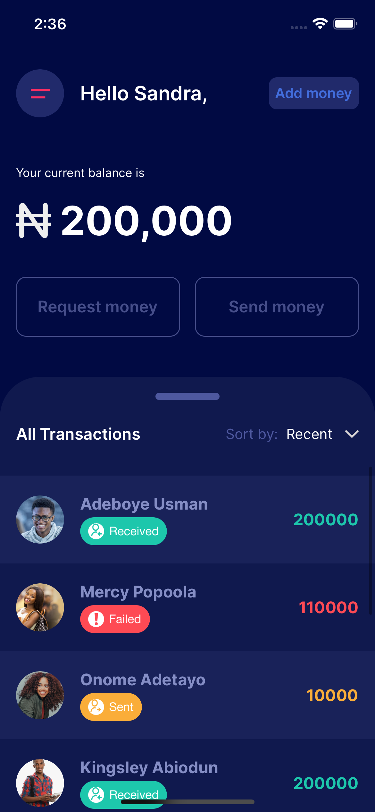

# pay1m

PaymentAppRN

## Getting started for Android

- Do `npm i` in root folder
- Now run Android application using `react-native run-android`
- In case `Metro Bundler` does not start automatically so use `npm start` to start npm in your system

## Getting started for iOS

- Do `npm i` in root folder
- Go into 'iOS' folder and run command 'pod install'
- open pay2mobile.xcworkspace and run project from xcode
- In case `Metro Bundler` does not start automatically so use `npm start` to start npm in your system

  
  
   
   

